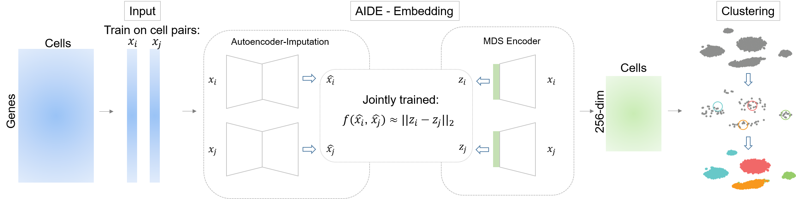

scAIDE
======================
> scAIDE is an unsupervised clustering framework for single-cell RNA-seq data. We revealed both putative and rare cell types in the 1.3 million neural cell dataset by global clustering. We obtained 64 clusters within 30 minutes, which were then mapped to 19 putative cell types. Three different subpopulations of neural stem/pregenitor cells were identified, each primed for different developmental stages. 

## Overview


## Table of content
- [Introduction](#Introduction)
- [Installation](#Installation)
    - [Required Packages](#--required-installations)
    - [Install](#--Install)
- [Example Usage](#example-usage)
    - [Preprocessing](#--Preprocessing)
    - [AIDE](#--AIDE)
    - [RPH-kmeans](#--RPH-kmeans)
    - [Biological Analysis](#--biological-analysis)
    - [Example Results](#--examples-results)
    - [Scalability](#--scalability)
- [Citation](#citation-&-references)
- [Maintenance](#Maintenance)

## Introduction
There are three main parts to this clustering framework: AIDE embedding, clustering (RPH-kmeans), and biological analysis.

- **AIDE**: autoencoder-imputed distance-preserved embedding (a novel deep learning architecture that learns a good representation of single-cell data accounting for biological noise)
- **RPH-kmeans**: Random projection hashing based k-means algorithm (a novel algorithm which improves the detection of rare cell types)
- **biological analysis**: Biological analytics code are packed into an R package, scAIDE.


## Installation
### - Required Installations
AIDE and RPH-kmeans are implemented in python, biological analytics code in R.

- Python3: tensorflow 1.14, numpy, scipy, scikit_learn, tqdm, seaborn
- R: parallel, gmp, ggplot2

### - Install
- AIDE: please refer to [https://github.com/tinglabs/aide](https://github.com/tinglabs/aide) for details.
- RPH-kmeans: please refer to [https://github.com/tinglabs/rph_kmeans](https://github.com/tinglabs/rph_kmeans) for details.
- scAIDE (R package):

	```r
require(devtools)
setwd("where scAIDE folder is located")
install("scAIDE")
```

## Example Usage:
A demo is provided in [demo](https://github.com/tinglabs/scAIDE/demo) folder, showing details of data preprocessing, embedding with AIDE and clustering with RPH-kmeans. Two datasets (`Mouse bladder` and `Mouse retina`) are also given.

### - Preprocessing
A pre-processed single-cell data is accepted, provided that it is normalized and log-transformed (for optimal performance). 
In Python, the input is configured as n cells (rows) by m genes (columns).


### - AIDE
```python
# Load data:
# For small to medium size datasets (up to few hundred thousands of cells)
import pandas as pd
import numpy as np

# Make sure that the final input is n cells (rows) by m genes (cols)
sc_data = pd.read_csv("single_cell_dataset.csv", index_col=0)
sc_data = sc_data.values.astype('float32') # type = np.ndarray

# Configuring AIDE parameters:
from aide import AIDE, AIDEConfig
config = AIDEConfig()
# We may tune the following 4 parameters, but default values are usually sufficient.
config.pretrain_step_num = 1000 # Pretrain step
config.ae_drop_out_rate = 0.4 # Dropout rate
config.alpha = 12.0 # A parameter that determines the portion of AE loss vs MDS encoder loss
config.early_stop = True # Early stop (maximum step number = 20000, minimum step number = 4000)

# Running AIDE:
encoder = AIDE(name = "sc_test", save_folder = "sc_test_folder")
sc_embedding = encoder.fit_transform(sc_data, config=config)

# save embedding
np.savetxt("~/sc_embedding.txt", sc_embedding)
```

### - RPH-kmeans

```python
from rph_kmeans import RPHKMeans
# In the case that n_clusters is already known:
clt = RPHKMeans(n_init=10, n_clusters=10)
clt_labels = clt.fit_predict(sc_embedding)

# In the case that n_clusters is unknown: In order to automatically detect the number of clusters, 
# we implemented a weighted BIC value that determines the optimal k based on 'kneedle' point.
from rph_kmeans import select_k_with_bic
kmax = 30 # set the maximum number of k to explore
optimal_k, _, _ = select_k_with_bic(sc_embedding, kmax=kmax)
clt = RPHKMeans(n_init=10, n_clusters=optimal_k) # run RPH-kmeans with optimal_k to get the clustering results
clt_labels = clt.fit_predict(sc_embedding)

# Output results
np.savetxt("~/clt_labels.txt", clt_labels)
```

### - Biological Analysis

```r
library(scAIDE)

# load original data and clustering results:
sc_data <- read.csv("single_cell_dataset.csv", header = T, row.names = 1) # rows = genes, cols = cells
sc_clusters <- read.table("clt_labels.txt")$V1
# Evaluate wilcox rank sum test and log fold change values
eval_gene_markers <- store_markers(gene_expression_data, sc_clusters, threads = 8)
gene_names <- rownames(gene_expression_data)
# returns the list of markers for each cluster, with your specified threshold
cluster_markers_list <- curate_markers(eval_gene_markers, gene_names, wilcox_threshold=0.001, logfc_threshold=1.5)

# Cell type assignment probability according to the markers in the database
# panglao_marker_list: pre-processed list of markers for neural and immune cell types.
# returns a cluster (rows) by cell types (cols) matrix
celltype_prob <- calculate_celltype_prob(cluster_markers_list, panglao_marker_list, type = "jacc")
celltype_id <- rowMaxs(celltype_prob)

# Enrichment probability (based on hypergeometric distribution), this is to be compared with celltype_id to ensure that the number of marker genes detected is of statistical significance.
n_genes <- nrow(gene_expression_data)
# returns a cluster (rows) by cell types (cols) matrix, with p-value entries
enrichment_prob <- calculate_enrichment_prob(cluster_markers_list, panglao_marker_list, n_genes, type = "jacc")

######################################################################
# Visualizing marker genes:
# example marker list:
selected_marker_genes <- c("SOX2", "ALDOC", "CCND2", "OLIG1", "OLIG2")
gene_expression_subset <- gene_expression_data[match(tolower(selected_marker_genes), tolower(rownmaes(gene_expression_data))), ]
# Process the data for plots
processed_markers <- process_marker_expression(gene_expression_subset, sc_clusters)
# Specify the cell type order, and the gene order that you wish to plot
cell_levels <- unique(sc_clusters)
gene_levels <- selected_marker_genes
marker_plot <- plot_marker_expression(processed_markers, gene_levels=gene_levels, cell_levels=cell_levels)
```

### - Example results
We will provide the annotated labels for all the analysis given in the manuscript, these will be updated as .RData files soon. </br>
The following figures show the results for a PBMC 68k dataset and the 1.3 million neural dataset. 

<p align="center">
  
  
</p>

### - Scalability
This section will be updated soon. The time taken to cluster 1.3 million cells (with roughly 20,000 genes) is less than 30 minutes, using 7GB of memory.

## File Illustation
- `sc_cluster`: Codes and results of clustering experiments using AIDE and RPH-kmeans.
- `baseline`: Codes and results of clustering experiments using baseline tools (e.g. DCA, MAGIC, scScope, scDeepCluster, ...).
- `demo`: A demo of data preprocessing, embedding with AIDE and clustering with RPH-kmeans.
- `scAIDE`: The R package of biological analysis.
- `figures`: Figures of README

## Citation & References

This work is currently under submission. scAIDE: Clustering large-scale single-cell data reveals putative and rare cell types.


References:
###### 1. Zheng, G. X. et al. (2017) Massively parallel digital transcriptional profiling of single cells. Nature Communications 8, 14049, doi:10.1038/ncomms14049
###### 2. Genomics, X. J. C. B. 1.3 million brain cells from E18 mice. (2017).
###### 3. Franzen, O., Gan, L. M. & Bjorkegren, J. L. M. PanglaoDB: a web server for exploration of mouse and human single-cell RNA sequencing data. Database (Oxford) 2019.

## Maintenance

If there's any questions / problems regarding scAIDE, please feel free to contact Ken Xie - xkk17@mails.tsinghua.edu.cn and Huang Yu - yuhuang-cst@foxmail.com. Thank you!

