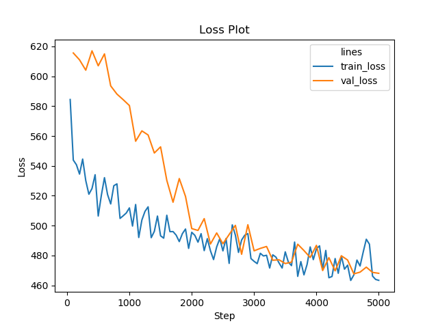
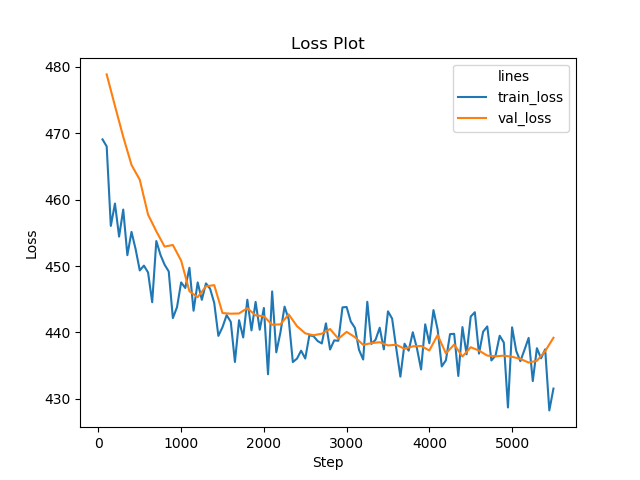

# Demo
- This is a demo for analyzing `Mouse bladder` (small data; 2746 cells *	20670 genes) and `Mouse retina` (large data; 27499 cells * 13166 genes), including the recommended data preprocessing, embedding with AIDE and clustering with RPH-kmeans.
- The two dataset are located in `data` folder.
- The running results are located in `aide_for_bladder` folder and `aide_for_retina` folder respectively.
- For both of the AIDE and RPH-kmeans, default hyper-parameters are used in this demo.

## For small data
The code of analyzing the `Mouse bladder` dataset are provided in `small.py`. Simply run the script (`python3 small.py`) and the running log is as follows:

```
Pretrain begin============================================
Step 50(5.0%): Batch Loss=494.993896484375
Step 100(10.0%): Batch Loss=473.5043029785156
...
Step 950(95.0%): Batch Loss=432.5137634277344
Step 1000(100.0%): Batch Loss=412.89599609375
Pretrain end.============================================
Step 50(0.25%); Global Step 50: Batch Loss=584.4363403320312; [Reconstruct, MDS, L2] Loss = [523.41284, 5.085291, 0.0]
...
Step 5100(25.5%); Global Step 5100: Validation Loss=468.5406188964844; [Reconstruct, MDS, L2] Loss = [451.28278, 1.4381549, 0.0]; Min Val Loss = 467.6856384277344; No Improve = 5; 
Step 5150(25.75%); Global Step 5150: Batch Loss=468.8702392578125; [Reconstruct, MDS, L2] Loss = [450.14258, 1.5606391, 0.0]
Step 5200(26.0%); Global Step 5200: Batch Loss=459.5696716308594; [Reconstruct, MDS, L2] Loss = [443.746, 1.3186402, 0.0]
No improve = 6, early stop!
Training end. Total step = 5200
Type of embedding = <class 'numpy.ndarray'>; Shape of embedding = (2746, 256); Data type of embedding = float32
RPH-KMeans (n_init = 1): ARI = 0.6105 (0.0279), NMI = 0.7604 (0.0086)
RPH-KMeans (n_init = 10): ARI = 0.6679 (0.0630), NMI = 0.7754 (0.0135)
KMeans (init = k-means++, n_init = 1): ARI = 0.5785 (0.0377), NMI = 0.7644 (0.0126)
KMeans (init = k-means++, n_init = 10): ARI = 0.5821 (0.0302), NMI = 0.7648 (0.0070)
```

Here shows the history loss of AIDE:



## For large data (e.g. cell_num > 100000)
The code of analyzing the `Mouse retina` dataset are provided in `large.py`. Simply run the script (`python3 large.py `) and the running log is as follows:

```
Pretrain begin============================================
Step 50(5.0%): Batch Loss=458.53656005859375
Step 100(10.0%): Batch Loss=443.490234375
...
Step 950(95.0%): Batch Loss=420.61492919921875
Step 1000(100.0%): Batch Loss=427.2901611328125
Pretrain end.============================================
Step 50(0.25%); Global Step 50: Batch Loss=469.0723876953125; [Reconstruct, MDS, L2] Loss = [445.16647, 1.9921587, 0.0]
...
Step 5700(28.5%); Global Step 5700: Validation Loss=436.14697265625; [Reconstruct, MDS, L2] Loss = [429.66595, 0.54008174, 0.0]; Min Val Loss = 435.47027587890625; No Improve = 5; 
Step 5750(28.75%); Global Step 5750: Batch Loss=434.73870849609375; [Reconstruct, MDS, L2] Loss = [428.11176, 0.5522464, 0.0]
Step 5800(29.0%); Global Step 5800: Batch Loss=439.7626037597656; [Reconstruct, MDS, L2] Loss = [432.93768, 0.56874436, 0.0]
No improve = 6, early stop!
Training end. Total step = 5800
Type of embedding = <class 'numpy.ndarray'>; Shape of embedding = (27499, 256); Data type of embedding = float32
RPH-KMeans (n_init = 1): ARI = 0.8914 (0.0306), NMI = 0.8248 (0.0117)
RPH-KMeans (n_init = 10): ARI = 0.8859 (0.0155), NMI = 0.8246 (0.0054)
KMeans (init = k-means++, n_init = 1): ARI = 0.7556 (0.1552), NMI = 0.7944 (0.0228)
KMeans (init = k-means++, n_init = 10): ARI = 0.6659 (0.1138), NMI = 0.7895 (0.0209)
```

Here shows the history loss of AIDE:


